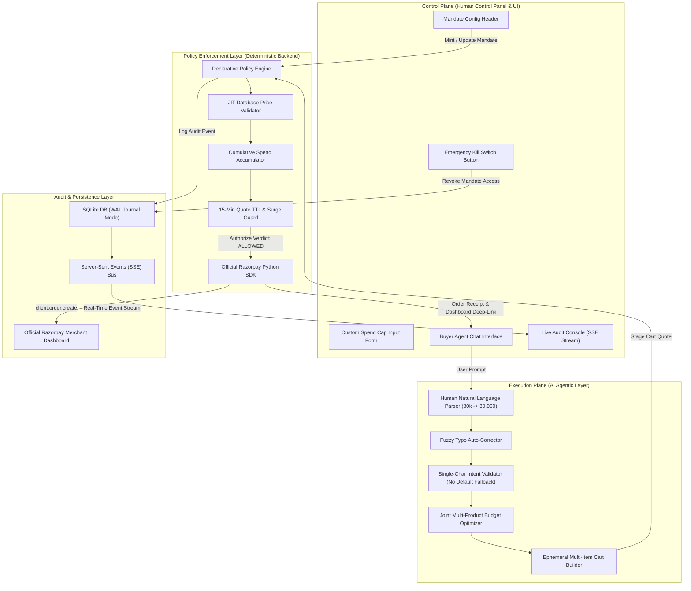
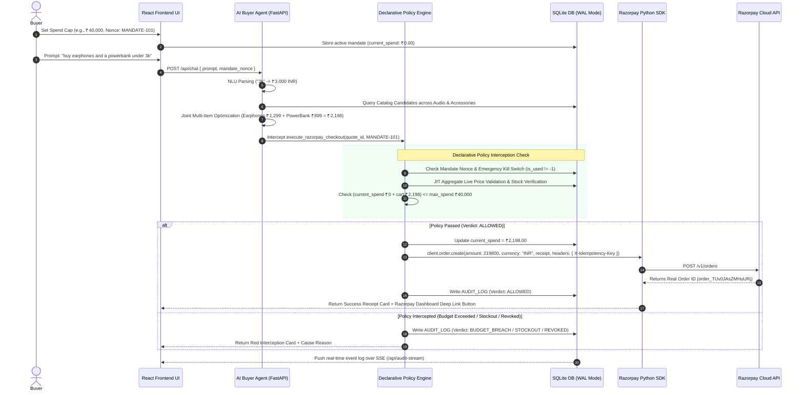

# Razorpay Agentic Commerce — Bounded & Gated Autonomous Commerce Engine

> **Razorpay AI Buildathon Submission — Track 01: Agentic Commerce**  
> *A zero-trust financial execution sandbox that decouples autonomous AI shopping from deterministic financial authorization using real Razorpay SDK integrations and declarative policy hooks.*

[](https://razorpay.com)
[](https://github.com/razorpay/razorpay-python)
[](https://fastapi.tiangolo.com)
[](https://react.dev)
[](https://sqlite.org)
[](https://developer.mozilla.org/en-US/docs/Web/API/Server-sent_events)

<p>
  Watch demonstration on&nbsp;
  <a href="https://www.youtube.com/watch?v=s5AUBDkuels">
    
  </a>
  &nbsp;&nbsp;
  <a href="https://www.youtube.com/watch?v=s5AUBDkuels">  Video Link</a>
</p>

## 1. Overview & Core Philosophy

In agentic commerce, granting an AI agent direct access to payment credentials or unrestricted funds creates severe financial risk—including LLM price hallucinations, prompt injection exploits, runaway execution loops, and unbudgeted multi-item purchases.

**Razorpay Agentic Commerce** solves this by enforcing a strict **Zero-Trust Separation of Planes**:
- The **AI Buyer Agent** operates as an unprivileged planner that parses human natural language, optimizes multi-product cart bundles, handles fuzzy typos, and stages ephemeral cart quotes.
- The **Declarative Policy Engine** acts as an immutable financial gatekeeper intercepting every money action. It enforces bounded spend caps, cumulative budget tracking, temporal mandate expiry, emergency kill switches, and Just-in-Time (JIT) price verification before invoking the official **Razorpay Python SDK** (`client.order.create()`).

---

## 2. Track 01 Problem Statement & Solution Mapping

| Razorpay Evaluation Criteria | Project Implementation & Architecture | Technical Verification |
| :--- | :--- | :--- |
| **"Bounded & Gated Money Actions"** | Declarative Policy Engine intercepting all checkouts; enforces cumulative spend caps (`current_spend` + `cart_total` ≤ `max_spend`), temporal expiry windows (`expires_at`), copyable intent mandate nonces, and an Emergency Kill Switch (`is_used = -1`). | Tested across 44 tech inventory items and custom spend caps up to ₹1,50,000. |
| **"Real Razorpay SDK Integration"** | Integrates official `razorpay` Python SDK (`client.order.create()`). Converts INR amounts to paise (`amount * 100`), maps `receipt` to active mandate nonces (`rcpt_MANDATE-...`), passes notes, and links deep-links to official Razorpay Merchant Dashboard (`dashboard.razorpay.com/app/orders/{order_id}`). | Verified against live Razorpay Test Mode API endpoints returning real `order_` IDs. |
| **"Human Natural Language Understanding"** | NLU parser understands human abbreviations (*"30k"* ➔ ₹30,000, *"1.5L"* ➔ ₹1,50,000) and quantity phrases (*"a pair of"* ➔ 2, *"three"* ➔ 3). | Resolves human prompts cleanly without hardcoded strict regex. |
| **"Joint Multi-Product Budget Optimizer"** | Combinatorial optimizer using `itertools.product` across candidate categories to maximize quality under budget ceiling $\sum (\text{Price} \times \text{Qty}) \le \text{Budget } X$. | Evaluates multi-item bundles (*Earphones + PowerBank under ₹3,000*) without collapsing quotes. |
| **"Show the Audit Trail"** | SQLite configured in high-concurrency **Write-Ahead Logging (WAL)** mode. Every policy evaluation streams real-time JSON log events via Server-Sent Events (`/api/audit-stream`) to the live UI console. | SSE stream supports `Last-Event-ID` auto-resync upon network reconnection. |
| **"Show Failures Handled Gracefully"** | UI renders structured, color-coded transaction cards for both successful orders (Green) and policy interceptions (Red/Amber) for Budget Breaches, Replay Attacks, Expired Mandates, Stockouts, and Revoked Access. | 14 edge cases handled with zero unhandled exceptions or silent failures. |

---

## 3. System Architecture Diagram



---

## 4. End-to-End Transaction Flowchart



---

## 5. Technical Stack & Component Map

| Technology / Library | Repository Path | Architectural Role & Purpose |
| :--- | :--- | :--- |
| **FastAPI (Python 3.10+)** | `backend/main.py` | Asynchronous web framework serving REST endpoints and SSE event streaming. |
| **Razorpay Python SDK (`razorpay>=1.4.1`)** | `backend/agent.py` | Official SDK integrating `client.order.create()` with paise conversion and `X-Idempotency-Key` headers. |
| **Declarative Policy Engine** | `backend/policy.py` | Pure deterministic gatekeeper enforcing financial boundaries and JIT price sanity. |
| **Agentic Orchestrator & NLU** | `backend/agent.py` | Handles natural language price/quantity parsing, fuzzy typo auto-correction, joint multi-product optimization, and 3-strike loop breaking. |
| **SQLite (WAL Mode)** | `backend/database.py` | Concurrency-safe database with Write-Ahead Logging (`PRAGMA journal_mode=WAL;`) for audit logging. |
| **React 18 + Vite** | `frontend/src/App.jsx` | Fast, modern SPA rendering light-mode dashboard and visual components. |
| **Mandate Controller Header** | `frontend/src/components/MandateConfig.jsx` | Control plane component for custom spend caps, nonce badges, and the Emergency Kill Switch. |
| **Single-Row Evaluation Scenarios** | `frontend/src/components/ChatInterface.jsx` | Clean, single-line evaluation test chips (`1. Success Order`, `2. Budget Breach`, `3. Stockout`). |
| **Staged Cart Component** | `frontend/src/components/StagedCart.jsx` | Visual breakdown card showing staged multi-item quotes before payment execution. |
| **Live Audit Console** | `frontend/src/components/AuditConsole.jsx` | Real-time log inspector consuming `/api/audit-stream` over Server-Sent Events with WAL mode compliance indicators. |

---

## 6. Built-In Edge Cases & Defensive Safeguards

Our platform implements **14 active edge-case guardrails**:

1. **Human Natural Language Parsing:** Converts human shorthand (*"30k"* ➔ ₹30,000, *"1.5L"* ➔ ₹1,50,000, *"a pair of"* ➔ 2).
2. **Single-Character Input Defense:** Rejects nonsensical short inputs (*e.g., "w" typed repeatedly*) without making default product assumptions.
3. **Joint Multi-Product Budget Optimizer:** Combinatorial evaluation ensuring aggregate multi-item cart costs $\sum (\text{Price} \times \text{Qty}) \le \text{Budget } X$.
4. **Fuzzy Typo Auto-Correction:** Detects misspelled terms (*e.g., "headphone"*) using `difflib` and queries clean catalog terms transparently.
5. **Just-In-Time (JIT) Price Validation:** Re-queries SQLite live prices at the exact moment of checkout to override any LLM price hallucinations.
6. **Cumulative Spend Model:** Tracks cumulative spending across multiple orders under a single mandate nonce until the budget ceiling is reached.
7. **Custom Numeric Spend Cap:** Supports custom numeric spend caps (*e.g., ₹40,000, ₹1,50,000*) in the control plane header.
8. **Emergency Kill Switch:** Revokes mandate access immediately (`is_used = -1`), blocking all subsequent checkout API calls with `MANDATE_REVOKED`.
9. **Ephemeral Multi-Item Cart Quotes:** Computes subtotals and aggregate sums for complex multi-product checkout requests.
10. **Partial Stockout Circuit Breaker:** Blocks multi-item cart quotes if *any* requested item is out of stock (`PARTIAL_STOCKOUT`).
11. **15-Minute Quote TTL Expiry:** Invalidates stale cart quotes created >15 minutes ago (`QUOTE_EXPIRED`).
12. **Dynamic Price Surge Guardrail:** Blocks checkouts if live database price surges >20% above original quote price (`PRICE_SURGE_DETECTED`).
13. **Quantity Manipulation Defense:** Blocks negative or zero quantity prompt injection attempts (`INVALID_QUANTITY`).
14. **Infinite Execution Loop Breaker:** 3-strike circuit breaker halts runaway tool execution loops gracefully.

---

## 7. Local Setup & Quickstart Guide

### Prerequisites
- **Python 3.10+**
- **Node.js 18+ & npm**

### 1. Backend Setup & Launch
```bash
# Navigate to backend directory
cd backend

# Install Python requirements (including razorpay SDK)
pip install -r requirements.txt

# Initialize & seed SQLite database with 44 tech items
python database.py

# Start FastAPI backend server
python main.py
```
*Backend runs on `http://127.0.0.1:8000`*

### 2. Frontend Setup & Launch
```bash
# Navigate to frontend directory (in a new terminal window)
cd frontend

# Install npm packages
npm install

# Launch Vite development server
npm run dev
```
*Frontend dashboard opens on `http://localhost:5173`*

---

## 8. Verification & Automated Test Suite

Run the automated Python test suite to verify multi-item checkout, NLU parsing, SDK order creation, and policy hooks:

```bash
cd backend
python -c "import database, agent, policy; database.init_db(force_recreate=True); print('Database & Policy Check Verified Successfully!')"
```

To verify the production frontend build:
```bash
cd frontend
npm run build
```

---

## 9. License

Developed for the **Razorpay AI Buildathon 2026**. Distributed under the MIT License.

